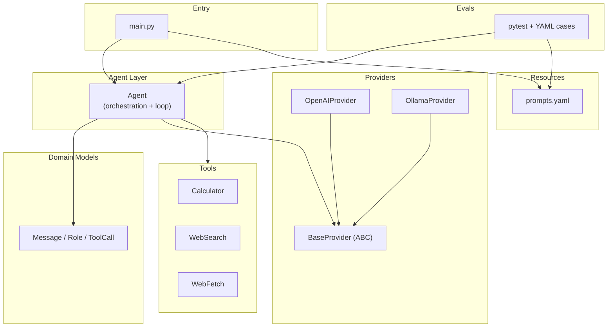

# mini-agent

A minimal LLM agent that talks to a model provider, calls tools, and maintains conversation history.

Supports **OpenAI** and **Ollama** providers, with tools for arithmetic, web search, and web fetch. Includes a pytest-based **eval harness** for regression-testing agent behavior.

## Project structure

```
mini-agent/
├── main.py                 # Entry point
├── agent.py                # Agent loop and orchestration
├── models/
│   └── message.py          # Internal conversation types + format helpers
├── providers/
│   ├── base_provider.py    # Provider interface (ABC)
│   ├── openai_provider.py  # OpenAI API adapter
│   └── ollama_provider.py  # Ollama SDK adapter
├── tools/
│   ├── base_tool.py        # Tool base class
│   ├── calculator.py       # Arithmetic via expression eval
│   ├── web_search.py       # DuckDuckGo search
│   └── web_fetch.py        # Fetch and extract page text (trafilatura)
├── resources/
│   ├── prompts.yaml        # Shared system prompts
│   └── loader.py           # YAML loader (prompts, eval cases)
├── evals/
│   ├── cases/              # YAML test cases
│   ├── assertions.py       # Expectation checks
│   ├── parsing.py          # Parse numbers/text from answers
│   ├── runner.py           # Run one eval case
│   ├── conftest.py         # pytest fixtures (agent factory, env)
│   └── test_calculator.py  # Calculator eval suite
└── pytest.ini
```

## Layer overview

| Layer | Files | Role |
|---|---|---|
| Entry | `main.py` | Wire up agent and run a task |
| Agent | `agent.py` | Loop, message history, tool execution |
| Models | `models/message.py` | Internal conversation types |
| Tools | `tools/` | Tool definitions and logic |
| Providers | `providers/` | Translate to/from provider APIs |
| Resources | `resources/` | Shared YAML config (prompts, cases) |
| Evals | `evals/` | pytest harness for agent regression tests |

**Key idea:** `Message` is the internal conversation format. Each provider translates at the boundary. The agent owns the loop and never calls a provider SDK directly.

## Tools

| Tool | Purpose |
|---|---|
| `calculator` | Evaluate Python-style math expressions (`1 + 1`, `(3 + 4) * 2`) |
| `web_search` | Search the web via DuckDuckGo; returns snippets and URLs |
| `web_fetch` | Fetch a URL and extract readable text with trafilatura |

For web questions, the system prompt instructs the agent to call `web_search` first, then `web_fetch` on a result URL when snippets lack the specific facts needed.

## Component relationships



## Agent loop

The agent stops when the model returns a message **without** `tool_calls`, or when `max_turns` is reached.

```
User message
     ↓
Call model ──→ tool_calls? ──Yes──→ Execute tools ──┐
                No                                  │
                 ↓                                  │
           Return final answer                      │
                 ↑                                  │
                 └──────────────────────────────────┘
```

## Setup

```bash
python -m venv .venv
source .venv/bin/activate
pip install -r requirements.txt
```

### OpenAI (default in `main.py`)

Create a `.env` file:

```
OPENAI_API_KEY=sk-...
```

### Ollama (optional)

Requires [Ollama](https://ollama.com/) running locally with a model pulled:

```bash
ollama pull qwen3:8b
```

## Run

```bash
python main.py
```

## Example

```python
from agent import Agent
from providers.openai_provider import OpenAIProvider
from resources.loader import load_system_prompt
from tools.calculator import Calculator
from tools.web_fetch import WebFetch
from tools.web_search import WebSearch

agent = Agent(
    provider=OpenAIProvider(),
    model="gpt-4o",
    tools=[Calculator(), WebSearch(), WebFetch()],
    system_prompt=load_system_prompt(),
)

reply = agent.run("what is 1 + 1")
print(reply.content)
```

Ollama works the same way — swap in `OllamaProvider()` and a local model name (e.g. `qwen3:8b`).

## Evals

Agent behavior is tested with **pytest** and YAML case files under `evals/cases/`.

```bash
pytest evals/test_calculator.py -v
```

Each case defines an input and expectations:

```yaml
- id: multiplication
  input: "what is 12345 x 1222"
  expect:
    must_call_tools: [calculator]
    answer_contains: "15085590"
    max_turns: 2
```

Supported expectation fields:

| Field | Checks |
|---|---|
| `must_call_tools` | Named tools appear in the message trace |
| `must_not_call_tools` | Named tools were not called |
| `answer_contains` | Final answer contains text (comma-normalized for numbers) |
| `answer_contains_any` | Final answer contains one of several phrases |
| `answer_close_to` | A number in the answer is within tolerance of expected value |
| `tolerance` | Relative tolerance for `answer_close_to` (default `0.01`) |
| `max_turns` | At most N assistant turns |

Eval cases and the app share the same system prompt via `resources/prompts.yaml`.

## Message formatting

For debugging, `Message.format_history(messages)` prints the conversation as readable chat history with message indices, tool calls, and content.
