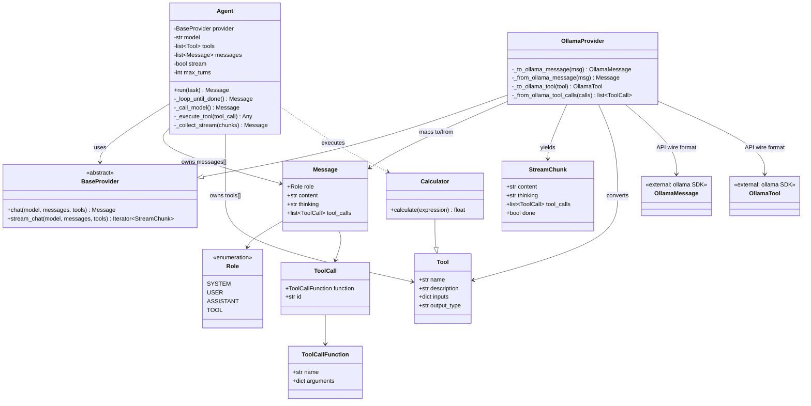
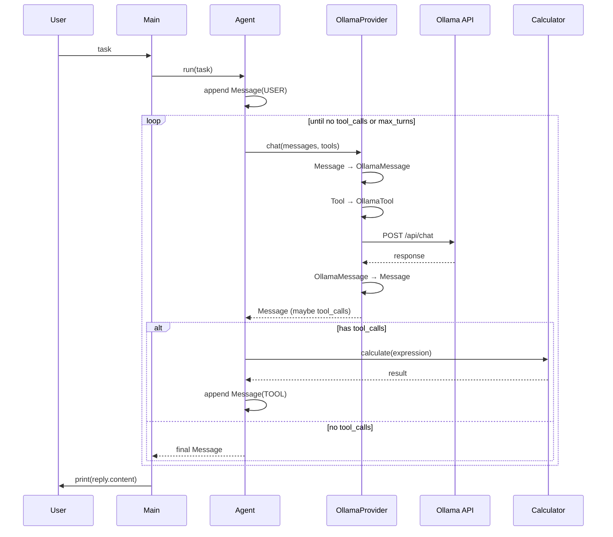

# mini-agent

A minimal LLM agent that talks to a model provider, calls tools, and maintains conversation history.

## Project structure

```
mini-agent/
├── main.py                 # Entry point
├── agent.py                # Agent loop and orchestration
├── models/
│   └── message.py          # Internal conversation types
├── providers/
│   ├── base_provider.py    # Provider interface (ABC)
│   └── ollama_provider.py  # Ollama SDK adapter
└── tools/
    ├── base_tool.py        # Tool base class
    └── calculator.py       # Calculator tool
```

## Layer overview

| Layer | Files | Role |
|---|---|---|
| Entry | `main.py` | Wire up agent and run a task |
| Agent | `agent.py` | Loop, message history, tool execution |
| Models | `models/message.py` | Internal conversation types |
| Tools | `tools/` | Tool definitions and logic |
| Providers | `providers/` | Translate to/from provider APIs |

**Key idea:** `Message` is the internal conversation format. Each provider translates at the boundary. The agent owns the loop and never calls Ollama directly.

## Class diagram



## Component relationships

```mermaid
flowchart TB
    subgraph Entry["Entry"]
        main["main.py"]
    end

    subgraph AgentLayer["Agent Layer"]
        Agent["Agent\n(orchestration + loop)"]
    end

    subgraph Domain["Domain Models"]
        Message["Message / Role / ToolCall"]
        StreamChunk["StreamChunk"]
    end

    subgraph ToolsLayer["Tools"]
        Tool["Tool (base)"]
        Calculator["Calculator"]
    end

    subgraph ProviderLayer["Providers"]
        BaseProvider["BaseProvider (ABC)"]
        OllamaProvider["OllamaProvider"]
    end

    subgraph External["External"]
        OllamaAPI["Ollama API / SDK"]
    end

    main --> Agent
    Agent --> Message
    Agent --> Tool
    Agent --> BaseProvider
    Calculator --> Tool
    OllamaProvider --> BaseProvider
    OllamaProvider --> Message
    OllamaProvider --> StreamChunk
    OllamaProvider --> OllamaAPI
    Agent ..>|execute| Calculator
```

## Runtime flow (one user turn with tools)



## Agent loop

The agent stops when the model returns a message **without** `tool_calls`, or when `max_turns` is reached.

```
User message
     ↓
Call model ──→ tool_calls? ──Yes──→ Execute tools ──┐
                No                                  │
                 ↓                                  │
           Return final answer                      │
                 ↑                                  │
                 └──────────────────────────────────┘
```

## Setup

```bash
python -m venv .venv
source .venv/bin/activate
pip install -r requirements.txt
```

Requires [Ollama](https://ollama.com/) running locally with a model pulled, e.g.:

```bash
ollama pull qwen3:8b
```

## Run

```bash
python main.py
```

## Example

```python
from agent import Agent
from providers.ollama_provider import OllamaProvider
from tools.calculator import Calculator

agent = Agent(
    provider=OllamaProvider(),
    model="qwen3:8b",
    tools=[Calculator()],
    system_prompt="You are a helpful assistant. Use tools when needed.",
)

reply = agent.run("what is 1 + 1")
print(reply.content)
```
